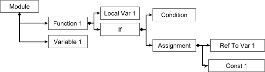

# Lifetime management
## and the smarter pointers

IMPORTANT: This is not an officially supported Google product.

[TOC]

About two decades ago there was a funny concept stated that any software architecture can be drawn with a handful of diagrams using a Universal Modelling Language (UML).
There are, among others, a diagram especially designed for data structures. Like this:


As you can see (or remember) UML diagram uses magic rombs to add ownership flavor to inter-object relationships.

There are three main types of ownership :
*  Composition. A owns B
   
*  Association. A knows B. No ownership
   
*  Aggregation. A shares the ownership over B with other objects
   

UML defines the clear rules of inter-object ownership. Architects draw models, define relation types, but when it comes to the code, everything gets erased: There's no industrial programing language adopting this ownership declarations. 
The LTM library define smart pointers that explicitly reflect UML abstractions and make application code robust, clear, and simple.

## Composition: when A has B

Let's start with composition, not only because of its simplicity but also because it is the essential base for all applications. By the way composition is the only one object relation type supported by XML/HTML DOM, JSON, Protobuf and most Databases.

### What for? (Examples)

Most of today's applications use some tree-like data structures.

#### Publication documents

MS-Word documents have lists of pages and a style sheets:


Each page has a set of page elements, and the style sheet has a set of named styles.

Page elements can also have sub-elements and so on:


Thus the Document data structure has tree-like topology.

#### Graphical User Interfaces

Application graphical user interface consists of forms or windows hosting groups of control elements:


#### Databases

SQL databases consist of tables, indexes, numerators, procedures and so on. All this data is organized in the tree-shaped hierarchy.


#### Compilers

Compilers operate on abstract syntax tree, though other compiler structures, such as name tables and base blocks also have tree-like structure.



In all above cases some objects exclusively own a tree of sub-objects.

This “A has B” relation named Composition and displayed with filled diamond arrow in UML.

### Invariants and operations
Composition assumes certain constraints that have to be guaranteed across all operations.
Composition constraints for "A has B":
*  B exists as long as A exists and A references B
*  B can have exactly one A.
*  B cannot be a direct or indirect owner of A.

Operations that can be performed on composition reference (R):
Creation:
*  R can be initially unassigned (null).
*  Destruction:
   If R is not null, its target should be destroyed. If target contained own composition references,  they should be also destroyed. So cutting of the composition reference is always the destruction of the whole subtree.
*  Assignment of new value (V) to R performed in three steps. 
   1. Make a deep copy of V subtree.
   2. Destroy the old value of R (also all subtree).
   3. Make R points to the result of deep copy operation.
The sequence of operations matters because V can be somewhere in the original value of R.

### Support in modern programming languages

All gc-driven languages (java,  c#, python, go-lang, js - name yours favorite), don't support it. Software developer supposed to write code for all copy and destruction operations manually. The best suggestion I saw for making copy is: “Serialize your structures to a memory stream and deserialize them back”. Very funny. And this doesn’t distinguish composition (owning) pointers from aggregation (shared) and from many entangled cases involving non-owning pointers. 
C++ has std::unique_ptr smart pointer implementing appropriate destruction behavior. But copy operations internationally left unimplemented and disabled. Other standard smart pointers don’t support aggregation at all.

### Support in LTM library

Composition semantics implemented by `ltm::own<T>` pointer.
All ltm objects should be descendants of `ltm::Object`. And each non abstract class should define `copy_to` method. LTM has handy macro to declare and define such method `LTM_COPYABLE(ClassName)`.
Suppose we have a document having pages with text blocks and images.

```C++
// Data structures
using ltm::Object;
using ltm::own;

struct PageElement : Object {
    int x, y, width, height; 
};
struct Page : Object {
    std::vector<own<PageElement>> elements;
    LTM_COPYABLE(Page)
};
struct Document : Object {
    std::vector<own<Page>> pages;
    LTM_COPYABLE(Document)
};
struct TextBlock : PageElement {
    std::string text; 
    LTM_COPYABLE(TextBlock)
};
struct Image: PageElement {
    std::string url; 
    LTM_COPYABLE(Image)
};

own<Document> doc;
int main() {
    doc = new Document;
    doc->pages.push_back(new Page);
    doc->pages[0]->elements.push_back(new TextBlock);
    doc->pages[0]->elements.push_back(new Image);
}
```

#### Example A. Make a copy of page 0
```C++
doc->pages.push_back(doc->pages[0]);
```


#### B. Copy elements from page to page
```C++
doc->pages[1]->elements.push_back(doc->pages[0]->elements[0]);
```


#### C. Delete page and all its content
```C++
doc->pages.erase(doc->pages.begin());
```


#### D. Dispose the old document and create a new one
```C++
doc = new Document;
```


## Association: when A knows B

Let's look at the Publication document again.


In this example:
*  Text and paragraph styles reference the named styles from the style sheets.
*  Multiple text blocks are connected in text flow sequences (where text that don't fit in particular block starts filling the next one).
*  Table of contents can be connected to specific headers (not drawn for the sake of simplicity).
*  Text fragments can be connected to the footnotes and so on.

I’ve drawn the non-owning references (associations) with dotted lines to better distinguish them from owning (composition) ones.

### More examples
Associations are not limited to publication documents. They are everywhere.

#### GUI Forms


*  Form element often have references to related graphic resources.
*  Form elements can reference other elements to control their state: focus/unfocus, disable/enable, show/hide etc.
*  There can be hyperlinks between forms.
*  Elements can have references to data model and/or controller.

#### Databases


Almost all database entities are linked internally:
*  Indexes are sorted lists of references to records.
*  Views, compiled requests, and index metadata hold references tables and field metadata.
*  Foreign Keys with cascade delete can also be implemented with collections of references to records.

### Common ideas about Associations
*  Association is a link between two object that doesn’t assume ownership.
*  These two objects can belong to different hierarchies and thus references can connect objects from different hierarchies.
*  References can produce arbitrary graph of connections even having cycles.
*  Object pointer by associative reference should be owned some other object by composition reference.

### Invarians and operations
*  If object A references object B with association pointer.
*  A and B have completely independent life times.
*  If A deleted before B, B becomes unreferenced by A.
*  If B deleted before A, the pointer becomes Null.
*  Making copy of A gives us two instances of A referencing the same B.
*  Making copy of B makes the original B referenced by A and a copy of B not referenced by any association pointes.
*  BUT, making a copy of a composite subtree, containing BOTH A and B gives us a composite subtree containing copies of A and B (A’ and B’ respectively) and A’ references B’ with association pointer.
   Thus the copy operation distinguishes the internal and external association pointers:
   1. External pointers are copied as is.
   2. Internal pointers are copied in the manner making the topology of copy graph match the topology of original graph.

### Examples of operations:

Assuming we have a diagram document. It contains a grouped visual blocks connected with automatically routed connector lines. It also has some style sheet used by visual elements.


This document structure defined by both compositions and associations. Smart connectors are visual elements linked with associative pointers (`A` and `B`) to other visual elements, that define its endpoints. And some elements are linked with associative pointers (`C`) to their styles in the style sheet.

What if we copy the Group1?
```C++
drawing->inner.push_back(drawing->inner[0]);
```


The copy operation is performed in the same way as in the previous composition examples.
Group1 and its subtree get copied.
Since associative reference `C` points outside the affected subtree, its copy (`C’`) just references the same target as the original pointer. The whole different story is with pointers `A` and `B` (`SmartConnector1` to `TextBlock1` and `SmartConnector1` to `TextBlock2`).
They connect elements in the tree, affected by copy operation. Thus their copies (`A’` and `B’`) should connect the same elements in the copied tree preserving its graph topology.

### Support in modern programming languages

Java has `WeakReference`, that becomes `null` if target is deleted. The same behavior is incorporated in C++ `std::weak_ptr<T>`.
But since none of this platforms support the copy operation automation, those weak pointers can’t deal with graph topologies.

### Support in LTM library

Association semantics is implemented in `ltm::weak<T>` pointer.
This pointer becomes `nullptr` if target deleted. And it supports copy operation as defined above.

Let’s define for example the same diagram document:
```C++
struct Visual : Object {
  weak<Style> style; //<<-------------- 1
};
struct Style : Object {
  int color, size;
  LTM_COPYABLE(Style)
};
struct Group : Visual {
  vector<own<Visual>> inner;
  LTM_COPYABLE(Group)
};
struct TextBlock : Visual {
  string text;
  LTM_COPYABLE(TextBlock)
};
struct SmartConnector : Visual {
  weak<Visual> start, end; //<<-------------- 2
  LTM_COPYABLE(SmartConnector)
};
struct Document : Group {
  vector<own<Style>> styles;
  LTM_COPYABLE(Document)
};
```
The class hierarchy is pretty straightforward. Lines (1) and (2) define weak pointers (associations).
```C++
void main() {
  // Create document.
  // See the Hierarchy Creation chapter for better code.
  own<Document> doc = new Document();
  auto group1 = new Group();
  doc->inner.push_back(group1);
  auto t1 = new TextBlock();
  auto t2 = new TextBlock();
  auto con = new SmartConnector();
  con->start = t1; // <--- association A from above diagram
  con->end = t2;   // <--- B
  group1->inner.push_back(con);
  group1->inner.push_back(t1);
  group1->inner.push_back(t2);
  auto s1 = new Style();
  doc->styles.push_back(s1);
  t2->style = s1;  // <--- C

  // Group1 copy
  doc->inner.push_back(doc->inner[0]);

  // Check the association (C) for null and use it.
  if (group1->inner[2]->style)
    use(group1->inner[2]->style->size);

  // Delete all document styles.
  doc->styles.clear();
  // Now all references to style1 are lost.
  assert(!group1->inner[2]->style);
}
```

## Aggregation: when A shares B with others

### Examples

`java.lang.String(s)` are examples of immutable objects, that can be easily and safely referenced from multiple hierarchies. Industry encourages and developers to introduce more and more immutable objects in application design. It is not only safe, it is also, under some limitations, space and time effective, because allows to share objects, eliminating the necessity of allocations and copy operations. GOF has special pattern “Flyweight” utilizing the shared ownership over immutable objects. UML introduces sharing ownership as the Aggregation, a special “many-to-one” relation type, portrayed in diagrams as not filled diamond connection:


### Invariants and operations
*  If a group of objects owns the object B in shared manner, there is a set A of aggregation pointers {An} references B.
*  B exists as long as the A≠∅.
*  If Ai gets deleted or breaks the reference to B, it excluded from A.
*  Assignment Ai to a new pointer C includes C in set A.

### Although it is not the mandatory property of aggregation, the following rules prevent multiple design flaws:
*  B should not be mutable. Because reference to it can be passed across subsystems, documents and even application boundaries. And its modification can cause random unpredictable changes of behavior across all computation platform.
*  There is one special consideration against mutability of B. Even if it is somewhat mutable (owns invisible to clients caches or performs memoizations), it should not contain mutable aggregation pointers to oneself data type. This rule prevents loops in ownership graphs.
*  Aggregation is strong ownership policy, so even immutable shared objects should utilize weak references in every scenarios not assuming ownership (listeners are always weak references).

### Support in modern programming languages

All references in modern managed GC-driven languages have aggregation semantic, and so C++ `std::shared`.

### Support in LTM

LTM discourage sharing and limits it to the scenarios where it is inavoidable or gives some benefits (like Flyweight pattern).
Objects have to be designed in a special way to support sharing. For example, it is meaningless to store `java.lang.String` in a single-owner pointer, because of `String` immutable nature.

And otherwise, if a `java.lang.StringBuilder` is stored in a shared-ownership pointers, its mutated state available for read/write from multiple hierarchies will quickly lead application to chaos.
So some objects are designed to be shared, and others are not. Thus there is only one owning pointer  in LTM - `ltm::own`, and sharing mode is encoded in pointee object.

All immutable objects starts their lifetimes as mutable. At least the object constructor should have the ability to create the object’s internal state, initializing its fields. During these operations object is mutable and thus shouldn’t be shared. That’s why the shared property is connected not to class but to each class instance.
Each `ltm::Object` is initially mutable and thus performs deep copy on assignments to `ltm::own<T>` pointers. But later - in constructors or as a result of some action on this instance - you can transform it to immutable state. As a part of such transformation you can make it shareable by calling `ltm::Object::make_shared()` protected method. Since this call, the `ltm::own<T>` pointers start sharing this instance on copy operations.
```C++
struct User {
  own<Name> name;
  Std::string text;
  User(own<Name> name) : name(std::move(name)) {}
  LTM_COPYABLE(User)
};
struct Name : ltm::Object {
  Std::string text;
  Name(std::string text) : text(std::move(text)) { make_shared(); } // {1}
  LTM_COPYABLE(Name)
}
Int main() {
  own<Name> john = new Name("John");
  own<User> j_doe = new User(john);
  own<User> j_smith = new User(john);
}
```
Now all three pointers ‘john’, ‘j_doe.name’, and ‘j_smith.name’ point to the same Name instance. This made possible because of make_shared call at line {1}.

Sometimes it is desirable to make a distinct copy of a shared object. An own<T>::force_copy() creates a distinct not shared instance, that could be modified (and made shared again if needed).

## Pinning

Weak and Owning pointers can become null at any moment as an action on its parent hierarchy. This makes it hard sometimes to call its methods or pass it as function parameters.
Imagine:
```C++{bad}
struct MyStruct: ltm::Object { int x = 0; };

ltm::own<MyStruct> root = new MyStruct;
ltm::weak<MyStruct> peer = root;


int main() {
  MyFunction(root.get(), peer); // don't do this
}

void MyFunction(MyStruct *ptr, weak<MyStruct> w_ptr) {
  root = new MyStruct; // here the old object gets deleted
  ptr->x = 42;         // now ptr points to garbage
  w_ptr->x = 11;       // now w_ptr is null
}
```

To address this issue the LTM library has the special pin-pointers, that prevent objects from being deleted for the duration of some ongoing operation. They’re intended to be used solely as temp or local pointers. A pin pointer controls its target lifetime using ref-counter and retain/release technique.
```C++
void MyFunction(pin<MyStruct> ptr, pin<MyStruct> p) {
  root = new MyStruct; // root points to a new one, but old one still alive
  ptr->x = 42;         // ok, work with the old object
  p->x = 11;           // ok
} // now the old object gets deleted
```
In fact `weak::operator->` returns a pin pointer, which `operator->` returns the real raw pointer. Thus calling a method of weak pointer target preserves the this object for the duration of this method.
*  Declaring the function parameter as a pin pointer guarantees that its target kept alive until function returns.
*  Declaring result type as pin, prevents memory leaks, because if caller won’t use the function result, it will be released at pin pointer destructor.

## Conversions weak-pin-own

Pointers automatically converted by initialization and assignments between pointers.
```C++
own<DataTable> table = new DataTable("Test");
weak<DataTable> table_ref = table;
pin<DataTable> t = table_ref;
pin<DataTable> t2 = table;
own<DataTable> table_copy = table_ref;
```

There is another possibility, that is handy when needed temps or auto initialization.
```C++
auto table_ref = table.weaked();
auto t = table_ref.pinned();
auto t2 = table.pinned();
auto table_copy = table_ref.owned();
```

It can be annotated with type.
```C++
auto element = block.pinned<PageElement>();
```

This is not a type cast, this is a way to produce a pointer of some base type.

## Type casting

Automatic upcasting to base types
```C++
own<TextBlock> block = new TextBlock(1, 1, 100, 100, "Text");
pin<PageElement> element = block;

Manual static_cast base-to-descendants:
own<PageElement> block = new TextBlock(1, 1, 100, 100, "Text");
pin<TextBlock> element = block.cast<TextBlock>();
// or
auto element = block.cast<TextBlock>().pinned();
```

## Getting rid of ‘new’

There are two ways of creating ltm objects.
```C++
own<TextBlock> element = new TextBlock(1, 1, 100, 100, "Text");
// or
auto element = own<TextBlock>::make(1, 1, 100, 100, "Text");
auto temp = pin<TextBlock>::make(1, 1, 100, 100, "Text");
```

Or if pointer type and created object are of different (but connected) types:
```C++
own<PageElement> element = new TextBlock(1, 1, 100, 100, "Text");
// or
auto element = own<PageElement>::make<TextBlock>(1, 1, 100, 100, "Text");
```

So if you for some reason dislike the new operator or afraid of memory leaks on exceptions thrown in constructors, you can use the second variant.

New can be also evaded in assignments to own<T> or pin<T> pointers:
```C++
own<TextBlock> block;
block =  new TextBlock(1, 1, 100, 100, "Text");
block.set<TextBlock>(1, 1, 100, 100, "Text");  // the same as above
block.set(1, 1, 100, 100, "Text");  // the same
block = nullptr;
```
Unfortunately make/set methods won’t work with initializer lists.

## Hierarchy Creation

Ltm allows to create object tree hierarchy in one expression storing along the way the raw pointers to the inside objects with mark method to make them accessible for setup cross-references later.
In the chapter “Association” there is a code sample that creates the document in series of assignments. This is the improved variant here:
The objects to create looked like this:


Classes are pretty much the same as in the original example, with addition some useful payload fields and constructors:
```C++
struct Style : Object {
  string font;
  int color, size;
  Style(string font, int color, int size)
      : font(std::move(font)), color(color), size(size) {}
  LTM_COPYABLE(Style)
};
struct Visual : Object {
  int x, y;
  weak<Style> style;
  Visual(int x, int y) : x(x), y(y) {}
};
struct Group : Visual {
  vector<own<Visual>> inner;
  Group(int x, int y, std::initializer_list<pin<Visual>> items)
      : Visual(x, y) { ltm::mc(inner, items); }
  LTM_COPYABLE(Group)
};
struct TextBlock : Visual {
  string text;
  TextBlock(int x, int y, string t) : Visual(x, y), text(std::move(t)) {}
  LTM_COPYABLE(TextBlock)
};
struct SmartConnector : Visual {
  int color;
  weak<Visual> start, end;
  SmartConnector(int color) : Visual(0, 0), color(color) {}
  LTM_COPYABLE(SmartConnector)
};
struct Document : Group {
  vector<own<Style>> styles;
  Document(int x,
           int y,
           std::initializer_list<pin<Visual>> items,
           std::initializer_list<pin<Style>> sts)
      : Group(x, y, items) { ltm::mc(styles, sts); }
  LTM_COPYABLE(Document)
};
```
An `ltm::mc` function helps creating `vector<own<T>>` from `initializer_list<pin<T>>`.

The creation code is simple:
```C++
own<Document> create() {
  Style* s1;
  SmartConnector* sc;
  TextBlock *t1, *t2;
  pin<Document> r = new Document(0, 0, {
    pin<Group>(new Group(10, 10, {
        pin<SmartConnector>::make(10).mark(sc),
        pin<TextBlock>::make(10, 0, "qwerty").mark(t1),
        pin<TextBlock>::make(10, 100, "zxcv").mark(t2)}))},
    {pin<Style>::make("Arial", 44, 12).mark(s1)});
  t2->style = s1;
  sc->start = t1;
  sc->end = t2;
  return r;
}
```

Object creation performed with single expression, that:
*  creates the object subtree with nested constructor calls,
*  along the way stores the cross-pointer sources and destinations with mark methods.
Aftermath we setup the necessary weak pointers.

## Proxies

Proxy is an object, that’s lifetime controlled by weak pointers.
A number of design patterns: bridges, adapters, decorators, require intermediate objects to be placed between caller and callee objects. If all we have at caller site is a weak pointer to interface implementation, this raises question, where these intermediate objects belong.
Proxy adapters can be created on demand, passed to caller, stored in weak pointers and proxy its calls to the real object with all necessary adaptations and decorations. Proxy object lifetime controlled with `weak`, `own`, and `pin` pointers.
Proxy can have internal state (like iterator) or be stateless. It can support shared or unique ownership.
```C++
struct ISized : ltm::Object {
  virtual int get_width() = 0;
  virtual int get_height() = 0;
};
struct FrameDecorator : ltm::Proxy<ISized> {
  weak<ISized> me;
  FrameDecorator(weak<ISized> me) : me(std::move(me)) { make_shared(); }
  int get_width() override { return me ? me->get_width() + 4 : 0; }
  int get_height() override { return me ? me->get_height() + 4 : 0; }
};
int get_area(weak<ISized> s) {
  return s ? s->get_width() * s->get_height() : 0;
}
void proxy_test(pin<ISized> p) {
  int s = get_area(pin<FrameDecorator>::make(p));
}
```
TODO: extend explanation.

## Delegates

Delegates are `std::functions` that capture weak pointer to its closure object.
They are handy in implementing the publisher/subscriber design pattern.
Since `ltm::weak` turns to `null` on target destruction, these delegates automate handling of publisher/subscriber lifetimes.
Since `ltm:weak` copy is topology aware, you can create a hierarchy of objects subscribed to each others’ events and easily copy it, preserving in the copy all inter-subscriptions of original objects.
```C++
struct Node : Object {
  own<Node> child;
  char c;
  function<void(char param)> handler = [](...){};
  Node(char c, const pin<Nod>& child = nullptr) : c(c), child(child) {}
  LTM_COPYABLE(Node)
};

void test_handlers() {
  auto root = own<Node>::make('a', pin<Node>::make('b'));
  root->handler = [ctx = root->child.weaked()](char param) { // {1}
    if (auto me = ctx.pinned()) me->c = param; // {check}
  };
  root->handler('x'); // {2}

  auto r2 = root; // {3}
  r2->handler('y');// {4}

  root->child = nullptr; // {5}
  root->handler('z'); // {6}
}
```
*  In line {1} a root.child object sets its handler to the root object.
*  In line {2} the root object notifies handler. So root.child.c now is ‘x’.
*  In line {3} we make a copy root and root.child objects, and the root_copy.handler context is now connected to the child_copy. So when in the line {4} r2 handler called, it is connected to r2.child object, and r2.child.c becomes ‘y’.
*  In line {5} we delete root.child and this disconnects root.handler. So in line {6} nothing happens. If you will need some action on disconnected handler, just add an else clause to the if statement at the line {check}.

In C++ version prior to v14, such delegates can be created either with bind or with nested blocks:
```C++
#if defined(USING_BIND)
  root->handler = std::bind(
      [](const weak<NodeWithHandler>& ctx, int param) {
        if (auto me = ctx.pinned())
          me->c = param;
      }, root->child.weaked(), _1);
#else
  {
    auto ctx = root->child.weaked();
    root->handler = [ctx](int param) {
      if (auto me = ctx.pinned())
        me->c = param;
    };
  }
#endif
```

## Multiple inheritance

Diamond inheritance is bad. All ltm pointers require its targets to be descendants of `ltm::Object`. But it is often handy to have multiple independent interfaces implemented by the single object. So this is why `ltm:pin<T>` and `ltm::weak<T>` has a specialization that can be bounded to T, not inherited from ltm::Object.
Suppose we have a completely isolated interface:
```C++
struct Interface {
  virtual void method1() = 0;
  virtual int method2(int param) = 0;
};
```
And a class, that at the same time an ltm::Object and the Interface implementation:
```C++
struct Impl : Object, Interface {
  int field1;
  Impl(int i) : field1(i) {}
  void method1() override {}
  int method2(int param) override { return field1; }
  LTM_COPYABLE(Impl)
};
```

Now we can operate it as Interface implementation:
```C++
void interaface_test() {
  auto c = own<Impl>::make(42); // {1}
  weak<Interface> w = c.weaked(); // {2}
  if (auto i = w.pinned()) // {3}
    i->method2(11);
}
```
Steps are:
*  Create the Impl instance {1}
*  Acquire a weak pointer to its Interface implementation {2}
*  Lock it {3}
*  Call interface methods.

The specialized `ltm::weak<T>` pointer acts the same way as ordinary `ltm::weak`.
*  Its copy operation is topology-aware,
*  It turned to nullptr on object destruction.

But it has special features:
*  Although it declared with arbitrary T it should be initialized from `own<X>`, or `weak<X>`, or `pin<X>` pointer where X is both static-castable to `T` and to `ltm::Object` (like in the above example).
*  It occupies two machine words in memory - twice the size of ordinary weak/pin/own.

## Unowned objects

Newly created `ltm::Object` has the special `not_owned` flag. When such objects are assigned to `own<T>` pointers, they are not copied, but instead marked as owned. The second and all subsequent assignment operations performed in a usual way with full subtree copy. This is handy for factory design patterns, where a function creates and returns the `pin<T>` pointer to the new instance, and the caller later assigns this `pin<T>` pointer to its `own<T>` field. 

This behaviour makes the code more readable and easy to support, but it has one safety issue: if such unowned object assigned to its own field of type `own<T>`, or an `own<T>` field of any of its sub-objects, this creates loop in composition relations. Thus it might be preferable to pass an own<T>& dst parameter to factory functions and use dst.set<Class>(params) to create objects.

## Bundle Copy

Then we copy two objects in single operation, it is not the same as when we make two separate copy operations.
*  In the first case all inter-object weak pointers were treated as inner and copied preserving topology.
*  While in the second case these weak pointers will be copied as outer ones for each separate copy operation.

Ltm has special `ltm::copy` function that can accept an iterator range and an inserter to copy all range as one operation. The common usage is:
1.  Create a container or `initializer_list` of `pin<T>` of objects that need to be copied, and an output container of `pin<T>`.
2.  Call `ltm::Object::copy`
3.  After the `copy` operation assign all resulting `pin<T>` to `own<T>` at desired locations.

If source and destinations are already iterable containers of `pin<T>` or `own<T>` they can be used directly.

There is a separate overload of ltm::copy that accepts (vector, start_index, end_index, insert_pos) to copy elements of the same vector.

## Move semantics

It’s supported.
It’s mostly usable for operations over `std::vector` items. Don’t rely on it too much, because C++ allows compiler to silently ignore move even  on `std::move`, for example on `initializer_lists` returning `const T&`.
And don’t abuse it because when you’re moving composition pointers from one object to another, you should precisely check if you aren’t creating loops in the composition graph. It’d be better to completely avoid `std::move` over ltm pointers.

## Multithreading

LTM don’t share global state. Thus ltm is thread-aware, but it is not thread-safe.
All copy, construction, and dispose operations on ltm pointers are safe as long as all objects belong to single thread.
LTM assumes that object hierarchy created on one thread belongs to this thread and processed in single-thread manner. Application code could pass the whole object tree or its detached subtrees to another thread using some request/response queues. This action transfers ownership over original hierarchy from thread to queue and from queue to new thread. Objects passed to another thread should form an enclosed domain by all its pointers (including the shared ones).

Note: Don't pass pointers across threads. Pass objects.

In process of implementation:
* Adding thread safe `ts_weak<T>`, `ts_pin<T>` that uphold target objects in thread-safe manner, where existing `weak<T>`, `pin<T>`, `own<T>` continue using fast counters and suitable in 99% cases where object is operated from thread it belongs.
* LTM-aware `thread_pool`, `port`, `task`. That automate object calling across threads. These primitives eliminate the necessity of synchronizations and `ts_weak/ts_pin`.

## Memory leak prevention

*  Don’t assign this to own<T> class fields in T constructors (‘this’ here is not_owned and can create loops).
*  Don’t modify own<T> fields in shared T objects.
*  Don’t use move semantic for object fields between different objects.
With these three don’ts the LTM guarantees the absence of memory leaks in your application.

Even without this limitations just usage of own/weak/pin pointers gives the same guarantees as using the managed GC environments give. (But without the usual x 2 GC memory consumption, and without sporadic stops).

## Overheads and Complexity

### Memory:
*  ltm::Object has one void* field. It stores own/pin counter, flags and/or pointer to the weak blocks that tracks weak pointer behaviour.
*  ltm::pin, ltm::weak, and ltm::own - are all of the size of one void*.
*  specialized ltm::weak and ltm::pin pointing to non-ltm::Object types have the size of two pointers: one references the retained/tracked ltm::object and another points to the interface implementation.
*  ltm::Objects referenced by weak pointers have additional ltm:WeakBlock structure that stores three pointer-sized fields (so since it has vmt, it occupies four mashine words). This structure stores lock counters for pin/weak/shared pointers and a pointer to the target object.
*  Construction/destruction/pinning/unpinning/copy operations do not allocate additional overhead memory.

### Time complexity:
*  Copy operation has O(N) time complexity where N is the number of elements.
*  All other operations have O(1) complexity.
Small memory and time overheads make it possible to use the LTM library even in low-end microcontrollers.

## Portability:

LTM uses two least significant bits of pointer fields for its own purpose and assumes that well formed pointers have 00 in these bits.
All nowadays architectures (x86, x64, ARM, ARM64, MIPS, SPARC) fit in this limitation.

## Conclusion

LTM is an object lifetime management library that:
*  Allows to create arbitrary data models.
*  1-to-1 maps to UML abstractions.
*  Automates copy/destruction operations.
*  Maintains sharing/not sharing ownership invariants and topology of cross-references.
*  Lightweight and simple.
*  Gives the same guarantees as GC without its resource consumption and sudden stops.
*  Unlike GC allows to control resources other than RAM.
